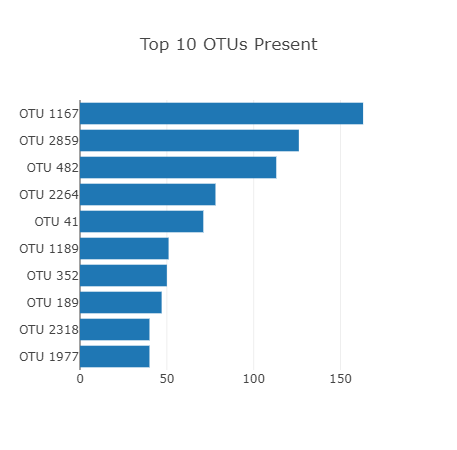
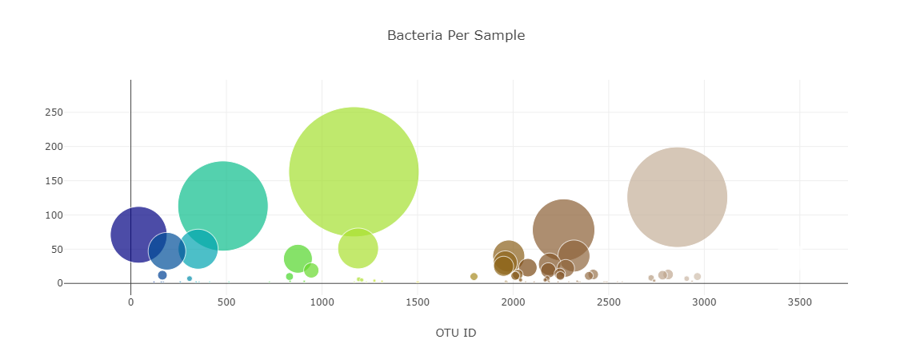
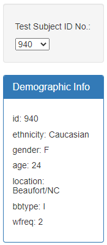

# belly-button-challenge
## Background
The purpose of this project is to build an interactive dashboard to explore the Belly Button Biodiversity dataset, which catalogs the microbes that colonize human navels.
The dataset reveals that a small handful of microbial species (also called operational taxonomic units, or OTUs, in the study) were present in more than 70% of people, while the rest were relatively rare.

## Steps:

1. I used the D3 library to read in `samples.jason` from the URL `https://2u-data-curriculum-team.s3.amazonaws.com/dataviz-classroom/v1.1/14-Interactive-Web-Visualizations/02-Homework/samples.json.`

2. Created a horizontal bar chart with a dropdown menu to display the top 10 OTUs found in that individual.

    * Used `sample_values` as the values for the bar chart.

    * Used `otu_ids` as the labels for the bar chart.

    * Used `otu_labels` as the hovertext for the chart.

    

3. Created a bubble chart that displays each sample.

    * Used `otu_ids` for the x values.

    * Used `sample_values` for the y values.

    * Used `sample_values` for the marker size.

    * Used `otu_ids` for the marker colors.

    * Used `otu_labels` for the text values.

    

4. Displayed each key-value pair from the metadata JSON object on the page.

      

